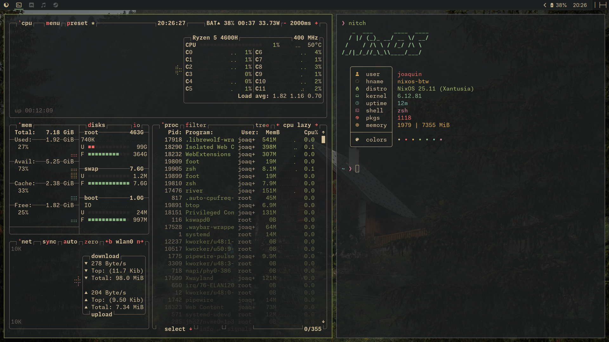
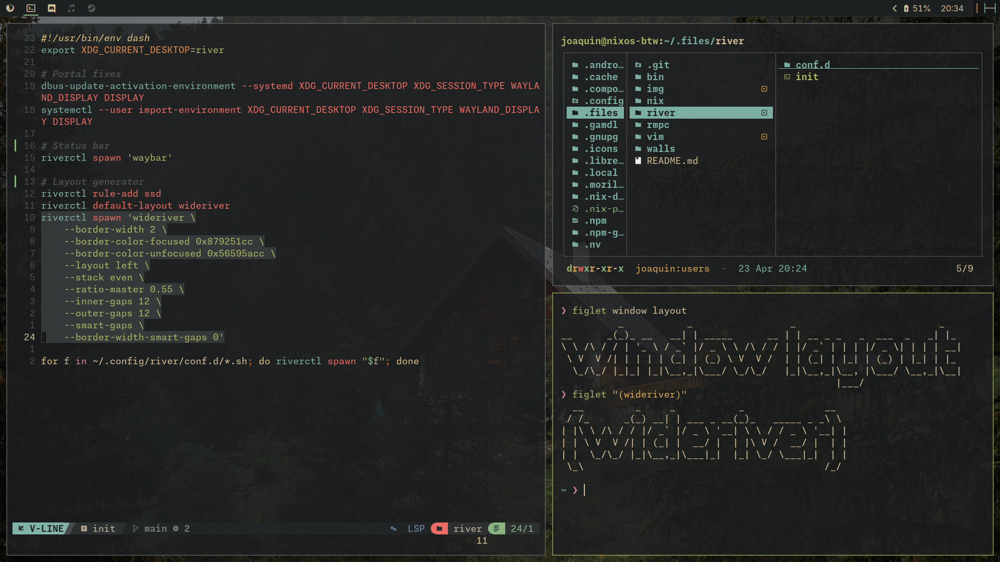
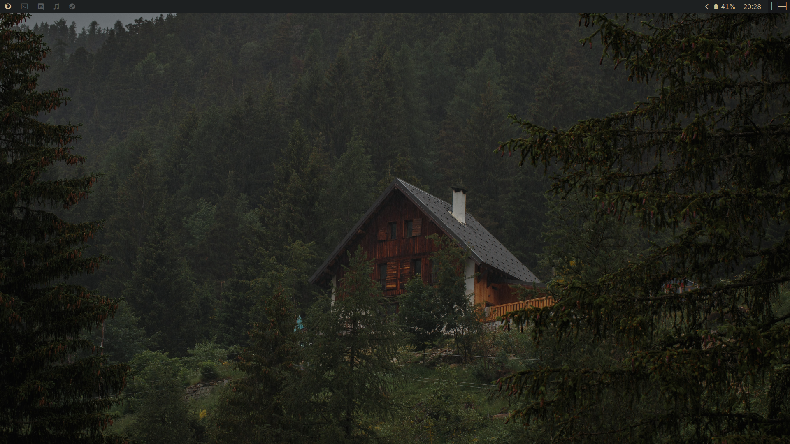
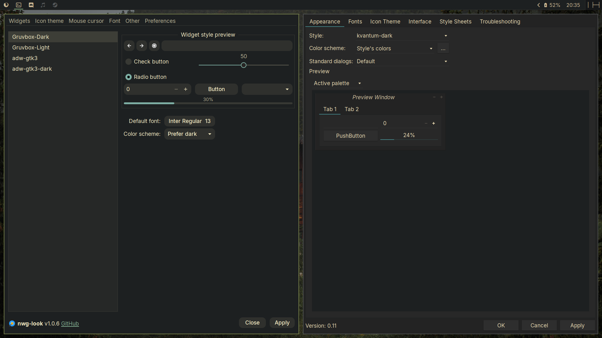

# Gruvforest: An environment of organic minimalism

> Press `Super + F1` to open the cheatsheet.

A fast, minimal, and fully reproducible Linux desktop built with Nix.
Designed for developers who want performance, clarity, and zero configuration drift.
Powered by Wayland and styled with Gruvbox Material Dark.

---

## Approach

Gruvforest is designed to work out-of-the-box on NixOS without requiring prior knowledge of the Nix language.

The system is fully declarative under the hood, but users are not expected to modify it directly to get a complete experience. Most tools are configured close to their upstream defaults, making them familiar and predictable.

> Features are enabled and disabled inside `./nix/features.nix`.

A small set of sensible applications (including PWAs via nix-flatpak) are preinstalled to provide a complete out-of-the-box experience. This includes optional support for common workflows such as gaming.

For deeper customization, understanding Nix is recommended—but not required to use the system as-is.

---

## Features

**Lightweight & Performant** — Uses a lightweight Wayland compositor instead of a full desktop environment, keeping resource usage low and responsiveness high.

**Daily Driver Ready** — Everything you need for a functional desktop without the bloat: a minimal yet powerful status bar, a fast app launcher (Super + P), essential utilities, sensible app defaults, and a small set of preconfigured applications for common workflows (including gaming).

**Outstanding Developer Experience** — A fully configured dev environment via Home Manager, featuring Neovim with a minimal, IDE-like configuration (NvChad-based) and a batteries-included terminal setup.

**Coherent & Declarative** — Almost everything is managed in pure Nix via Home Manager. No scattered config files.

---

## Installation

### Enable flakes

Add the following to your NixOS configuration:

```nix
nix.settings.experimental-features = [ "nix-command" "flakes" ];
```

Then rebuild your system:

```bash
sudo nixos-rebuild switch
```

### Install Gruvforest

```bash
git clone https://github.com/joaquin-angeles/.files.git
cd .files
sudo nixos-rebuild switch --flake --impure ./nix#nixos-btw
```

- `nixos-btw` is the default host configuration included in this repository
- `--impure` is required for hardware-specific configuration

---

## Customization

All configuration lives under three entrypoints:

| Path              | Purpose                                        |
| ----------------- | ---------------------------------------------- |
| `nixos/flake.nix` | Flake inputs, outputs, and top-level wiring    |
| `nixos/host/`     | System-level config (hardware, services, apps) |
| `nixos/home/`     | User environment via Home Manager              |

Extending or overriding modules is straightforward thanks to Nix's declarative nature.

---

## Preview

A clean, low-resource setup with a cohesive Gruvbox Material aesthetic.

| Resource usage                                 | Tiled layout                                 |
| ---------------------------------------------- | -------------------------------------------- |
|  |  |

| Background Wallpaper                                | GUI Applications                  |
| --------------------------------------------------- | --------------------------------- |
|  |  |
