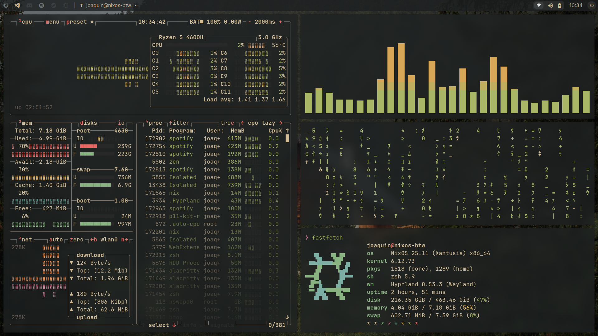
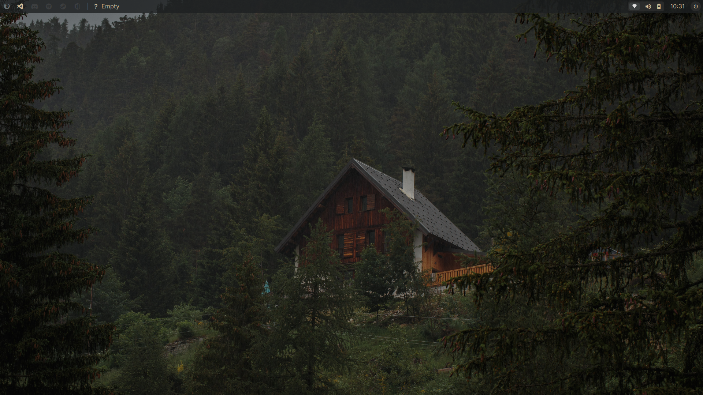
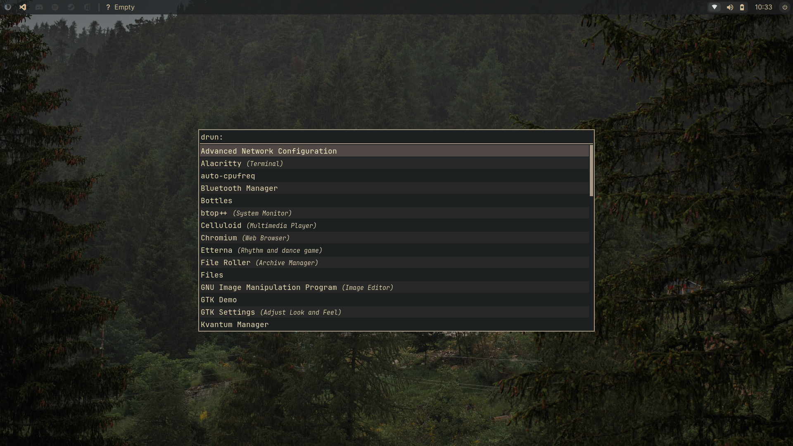
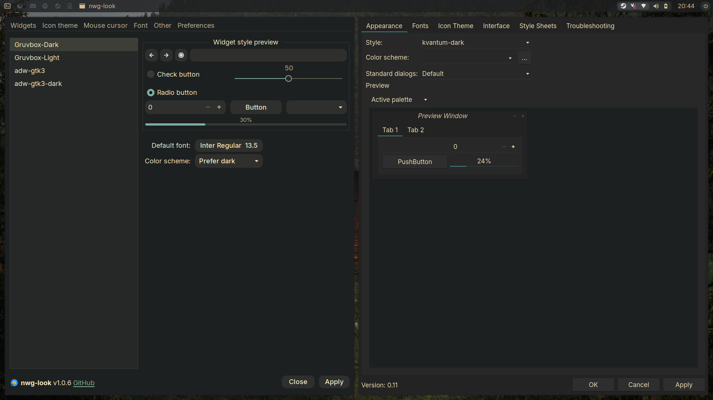

# Joaquin's Nix Dotfiles

> Press `Super + Shift + Space` to open the cheatsheet.

A modern, extensible **Hyprland/Wayland** configuration for Linux powered by the **Nix** package manager and the **Gruvbox** colorscheme. Fully declarative, reproducible, and easy to customize.

---

## Features

**Lightweight & Performant** — Hyprland is tuned for near-maximum efficiency, staying out of the way of demanding workloads.

**Near-Complete Daily Driver** — Everything you need for a functional desktop without the bloat: a minimal yet powerful Waybar panel, a fast app launcher (Rofi), essential utilities, and sensible app defaults.

**Outstanding Developer Experience** — A fully configured dev environment via Home Manager, including Neovim with NvChad, a batteries-included Zsh setup, and the Zellij terminal multiplexer.

**Coherent & Declarative** — Almost everything is managed in pure Nix via Home Manager. No scattered config files, no imperative scripts.

---

## Installation

> Requires NixOS with flakes enabled.
```bash
git clone https://github.com/joaquin-angeles/.files.git
cd .files
sudo nixos-rebuild switch --flake --impure ./nixos#nixos-btw
```

The flake also exposes a standalone `homeConfigurations.joaquin` output, so it can be used on any Linux system with Nix installed (not just NixOS):
```bash
home-manager switch --flake .#joaquin
```

---

## Customization

All configuration lives under three entrypoints:

| Path | Purpose |
|---|---|
| `nixos/flake.nix` | Flake inputs, outputs, and top-level wiring |
| `nixos/host/` | System-level config (hardware, services, apps) |
| `nixos/home/` | User environment via Home Manager |

Extending or overriding modules is straightforward thanks to Nix's declarative nature.

---

## Preview

| Tiled Layout | Wallpaper & Aesthetic |
|---|---|
|  |  |

| App Launcher | GUI Applications |
|---|---|
|  |  |
